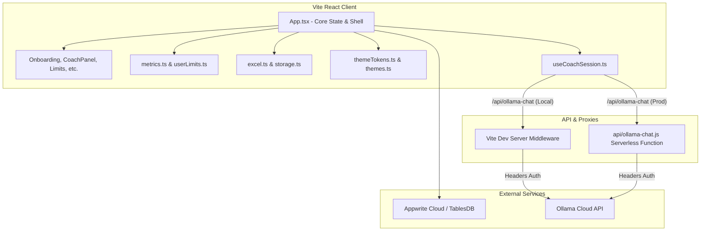

# Project Overview

Red Bull Intake Tracker is a premium web-based tracking dashboard designed for tracking caffeine
and beverage consumption, with a strong focus on Red Bull products. Built using React, Vite, and
TypeScript, it allows users to record intake (amount, flavour, size, price, timestamp, and location),
monitor daily spending and caffeine limits, view structured trends and streaks, import/export
data via styled Excel or JSON formats, and engage in real-time encrypted-compatible dialogue with an
AI wellness coach powered by a serverless Ollama proxy endpoint. Synchronized dynamically with
Appwrite Cloud databases using secure row-level document permissions, it delivers a highly reactive,
personalized, and privacy-first self-tracking experience.

## Repository Structure

- `api/` – Contains serverless backend handlers, including the API gateway proxy for Ollama chat endpoints.
- `dist/` – Contains static HTML, JavaScript, and CSS bundle files output by the production build process.
- `node_modules/` – Stores third-party library dependencies and packages managed by npm.
- `scripts/` – Houses automation scripts, including database schema configuration tools for Appwrite.
- `src/` – Contains client-side React source code, components, utility models, and stylesheets.
  - `src/components/` – Reusable UI panel elements, forms, and splash screen wrappers.
  - `src/data/` – Static configurations, including theme lists and built-in flavours mapping.
  - `src/lib/` – Business logic engines for calculations, file parsers, and Appwrite client connections.

## Build & Development Commands

Use the following shell-ready commands to install dependencies, run the application, lint the code,
and manage the cloud database.

### Dependency Installation
```bash
npm install
```

### Local Development Server
Starts a local development server at `http://localhost:5173`.
```bash
npm run dev
```

### Production Build & Bundling
Performs TypeScript diagnostic type-checks and compiles the application into the `dist/` directory.
```bash
npm run build
```

### Production Preview
Runs a local web server to preview the built production bundle.
```bash
npm run preview
```

### Code Linting
Runs ESLint over TypeScript files to identify syntax issues and code style warnings.
```bash
npm run lint
```

### Appwrite Cloud Database Setup
Automatically provisions the databases, tables, columns, and indexes on the configured Appwrite instance.
```bash
npm run setup:appwrite
```

### Automated Testing
> TODO: Add automated test suite command (e.g., `npm run test` using Vitest or Jest).

### Application Deployment
> TODO: Add production deployment pipeline command (e.g., Vercel, Netlify, or Docker deploy).

## Code Style & Conventions

- **Language**: TypeScript is strictly required for all UI components and logic scripts; JavaScript
  is limited to serverless handlers and build scripting.
- **Strict Checks**: TypeScript's `strict` compiler option is enabled; avoid using `any` and ensure
  all parameters and return values are explicitly typed.
- **Formatting**: Code should be formatted with 2-space indentation, trailing commas where supported,
  and double quotes for JSX/TSX properties.
- **Linting**: Rules are governed by ESLint (`eslint.config.js`), extending the standard TypeScript
  and React Hooks rulesets.
- **Naming Conventions**:
  - React components and files use PascalCase (e.g., `CoachPanel.tsx`).
  - Business logic, utilities, and helper hooks use camelCase (e.g., `appwriteEntries.ts`, `useCoachSession.ts`).
  - Constants and static metadata arrays use UPPER_SNAKE_CASE (e.g., `BUILT_IN_FLAVOURS`).
- **Imports**: Prefer explicit ES module imports (`import { ... } from "..."`). Avoid wildcards.
- **Commit Messages**:
  - > TODO: Define commit message guidelines and templates (e.g., Conventional Commits).

## Architecture Notes

### Flow Architecture Diagram



### Component Roles & Data Flow

1. **State Orchestration (`src/App.tsx`)**:
   Acts as the monolithic hub of the frontend. It manages user authentication states, currently
   selected views, active database operations, modals, onboarding triggers, and theme settings.

2. **Metrics & Limits (`src/lib/metrics.ts`, `src/lib/userLimits.ts`)**:
   Process raw intakes to extract total cans, spendings, caffeine absorption, hydration estimates,
   streaks, and coordinate warnings when user limits are breached or bedtime approaches.

3. **External Data Codecs (`src/lib/excel.ts`, `src/lib/storage.ts`)**:
   Implement styled spreadsheet formatting with `exceljs`, data sanity validation, duplicate-aware
   import preview engines, and local JSON backup/restore modules.

4. **Dynamic Styling (`src/lib/themeTokens.ts`, `src/data/themes.ts`)**:
   Computes CSS tokens dynamically from a selection of Vocaloid or beverage-themed configurations,
   writing variables into the document root for real-time visual styling modifications.

5. **Cloud Synced State (`src/lib/appwrite.ts`, `src/lib/appwriteEntries.ts`, `src/lib/coachChats.ts`)**:
   Establishes client tunnels to Appwrite's serverless TablesDB backend, running row-secured
   CRUD actions bound strictly to the current `userId`.

6. **AI Coach Chatbot (`src/lib/useCoachSession.ts`, `api/ollama-chat.js`)**:
   A state-machine custom hook that pipelines user questions, injects historical intake aggregates,
   and streams responses from DeepSeek through server-side Ollama proxy tunnels.

## Testing Strategy

The repository does not currently feature automated test files. Testing is executed manually.

### Unit & Integration Testing
- > TODO: Configure unit and integration tests (e.g., Vitest + React Testing Library) to validate
  metrics computations, limits checks, and file importing codecs.

### End-to-End (E2E) Testing
- > TODO: Introduce E2E test suites (e.g., Playwright or Cypress) to cover authentication paths,
  entry additions, theme switches, and chatbot conversation loops.

### Continuous Integration (CI)
- > TODO: Establish a GitHub Actions workflow pipeline to run linters, type checks, and tests on
  every branch commit or pull request.

## Security & Compliance

- **Authentication**: Delegated entirely to Appwrite's built-in OAuth/Email-password protocols.
  No user passwords or direct login credentials are saved inside the application state.
- **Client Security**: Client-side application calls only the Appwrite browser SDK. No administrative
  or server-level API keys are ever shipped or exposed to the client.
- **Database Row Security**: All Appwrite tables have `Row Security` enabled. Users are granted
  `create` permissions on the table level, but read, update, and delete actions require explicit
  document permissions matching the user's specific ID (`user:{userId}`).
- **LLM API Security**: To avoid key exposure, the client connects to the proxy path `/api/ollama-chat`.
  The secret `OLLAMA_API_KEY` is maintained exclusively in secure server-side environment variables.
- **Dependency Auditing**:
  - > TODO: Add automated dependency checking (e.g., `npm audit` or Dependabot) in the CI pipeline.
- **Software Licensing**:
  - > TODO: Add a standard LICENSE file (e.g., MIT, Apache-2.0) to explicitly detail terms of reuse.

## Agent Guardrails

- **Environment File Preservation**: Never edit, modify, or commit variables directly inside
  `.env.local` or `.env` templates unless explicitly instructed by the user.
- **Credential Safety**: Never add, write, or hardcode API keys, access secrets, project keys, or
  personal tokens into the codebase or configuration files.
- **Safe Directory Boundaries**: Do not add, write, or alter files inside administrative, system, or
  auto-generated directories like `.git`, `.gemini`, `dist`, or `node_modules`.
- **Monolithic State Warnings**: `src/App.tsx` contains the core layout and view engine. Exercise
  extreme care when making adjustments to prevent breaking the view transitions, auth hooks, or modals.
- **Database Alignment Rules**: Always verify that any changes to DB record structures or types are
  mirrored across `src/types.ts`, Appwrite modules (`src/lib/appwriteEntries.ts`, `src/lib/coachChats.ts`),
  and the migration runner `scripts/setup-appwrite.mjs`.

## Extensibility Hooks

- **Flavour Extensions**: New built-in Red Bull flavours, accent colors, and sugar-free rules can be
  easily appended to the `BUILT_IN_FLAVOURS` array in `src/data/flavours.ts`.
- **UI Custom Themes**: Additional visual themes, including Vocaloid, seasonal, or custom branding,
  can be integrated by adding definitions to the `APP_THEMES` array in `src/data/themes.ts`.
- **Proxy Endpoint Rerouting**: The Ollama upstream proxy route in `vite.config.ts` and
  `api/ollama-chat.js` can be adjusted to point to alternative LLM hosts or local server instances.
- **Configurable Environment Parameters**:
  - `VITE_APPWRITE_ENDPOINT` – Base URL for the Appwrite API server.
  - `VITE_APPWRITE_PROJECT_ID` – The Appwrite project instance identifier.
  - `VITE_APPWRITE_DATABASE_ID` – TablesDB target database identifier.
  - `VITE_APPWRITE_COLLECTION_ID` – Table ID containing intake documents.
  - `VITE_APPWRITE_CHAT_COLLECTION_ID` – Table ID storing coach chatbot threads.
  - `OLLAMA_API_KEY` – Administrative bearer authorization token for Ollama endpoints.
  - `OLLAMA_MODEL` – Upstream model identifier (default: `deepseek-v4-pro:cloud`).

## Further Reading

- [Appwrite Platform Documentation](file:///Users/ned/Documents/GitHub/Red%20Bull%20Tracking%20System/APPWRITE_SETUP.md) – Detailed guide on database configuration, attributes, indexes, and row permissions.
- [Appwrite Admin Schema Migrations](file:///Users/ned/Documents/GitHub/Red%20Bull%20Tracking%20System/scripts/setup-appwrite.mjs) – Automated table creation and attributes loader script.
- > TODO: Put architecture decision records (ADRs) or technical whitepapers under a dedicated `/docs` directory.
